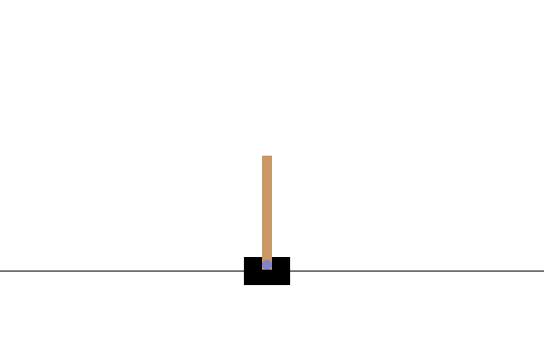
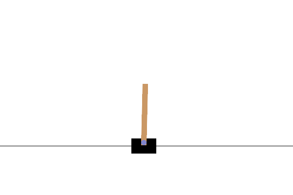

    

        
        
Before

    

    

        
         
After

    

**Project Descriptions**

Cartpole is a classic control problem in the field of Reinforcement Learning (RL) where the goal is to balance a pole on top of a cart moving on a frictionless track. It is a simple yet challenging task that requires the agent to make continuous decisions based on the current state of the environment to keep the pole upright while the cart moves left or right.

In the Cartpole environment, the state consists of four continuous variables representing the position and velocity of the cart and pole, respectively. The agent can take two discrete actions - move the cart either left or right. The agent receives a positive reward for every time step that the pole remains upright, and the game continues until the pole falls beyond a certain angle or the cart moves out of the track's boundaries.

 