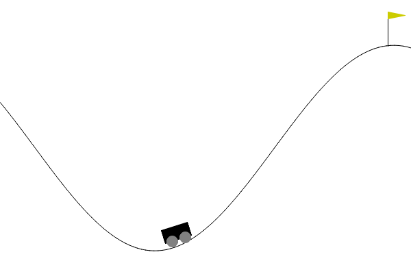

    

        
        
Before

    
 
    

        
         
After

    

 

**Project Descriptions**

Mountain Car is a classic reinforcement learning problem in which an underpowered car needs to climb a steep mountain by applying appropriate throttle and steering actions. The car starts in a valley and must learn how to build enough momentum to overcome gravity and reach the mountain top. The challenge is that the car's engine is not strong enough to directly ascend the mountain, so it must leverage the principles of reinforcement learning to discover effective strategies for reaching the goal state. Through trial and error, the car learns to optimize its actions and eventually succeeds in reaching the mountain top. The Mountain Car problem serves as a common benchmark for testing and evaluating reinforcement learning algorithms and approaches.

In the MountainCar-v0 environment, the goal is to get a car to the top of a hill by driving up a steep slope. The car is underpowered and cannot reach the top of the hill by simply driving straight up, so the agent must learn to use momentum to climb the hill.

The episode in MountainCar-v0 is considered finished when either of the following conditions is met:

- The car reaches the top of the hill and its position is greater than or equal to 0.5.

- The episode reaches 200 time steps.

At each time step, the agent receives a reward of -1, and the goal is to minimize the number of time steps required to reach the top of the hill. If the agent is able to reach the top of the hill before the episode ends, it receives a larger positive reward.

In the MountainCar environment, the observation is a one-dimensional array with two elements. The first element (index 0) corresponds to the position of the car, and the second element (index 1) corresponds to the velocity of the car.

There are three possible actions available to the agent: push left (action 0), no push (action 1), and push right (action 2).
